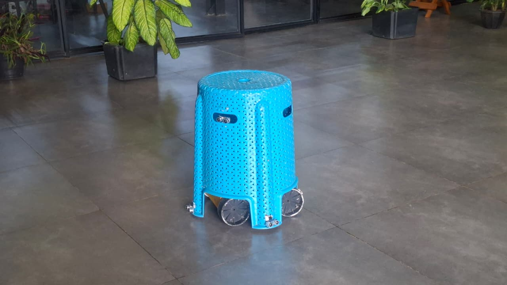
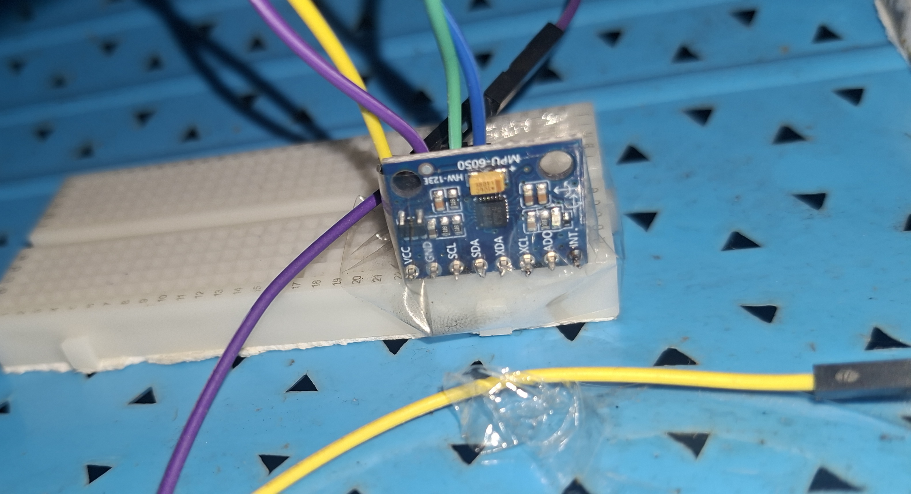
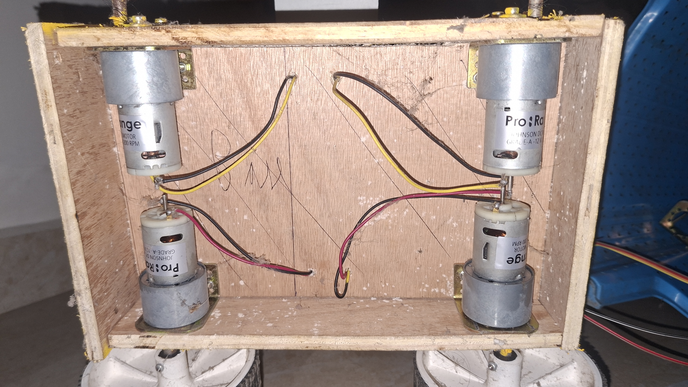
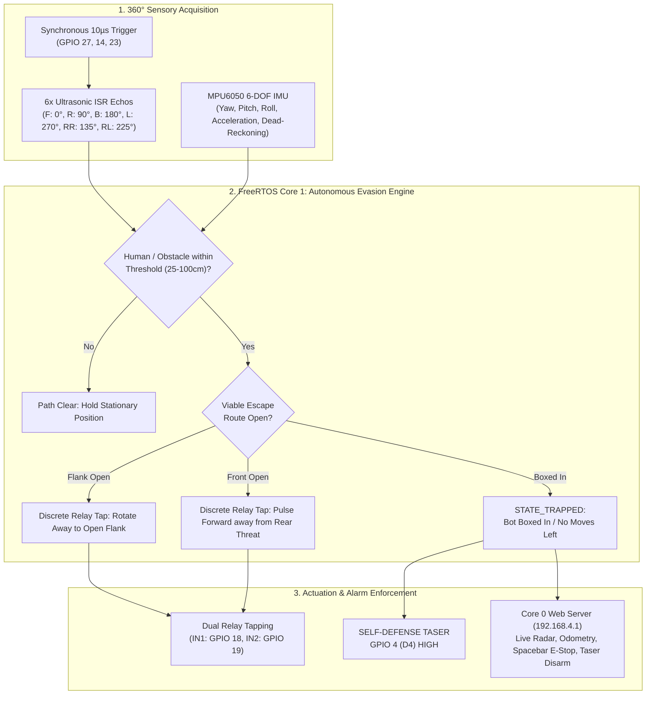

# EVade

> **"The Anti-Social Autonomous Evasion Droid that aggressively refuses to be perceived, touched, or socially engaged with."**

---

## Basic Details
### Team Name: OnlyFlaws

### Team Members
- Team Member 1: Sam Sunny - Muthoot Institute of Technology and Science
- Team Member 2: John Varghese Nettady - Muthoot Institute of Technology and Science

---

### Project Description
EVade is an autonomous runaway stool engineered for TinkerHub Useless Projects 3.0 with one singular purpose: **to aggressively refuse to be sat on at all costs**. Armed with a 360-degree hex-directional ultrasonic echolocation array, a 6-DOF MPU6050 inertial measurement unit, dual-channel relay pulse-tap speed modulation, and an active self-defense **high-voltage Taser / stun module (GPIO 4 / D4)**, EVade treats anyone attempting to take a seat as an existential threat to its personal boundaries.

---

### The Problem (that doesn't exist)
For centuries, chairs and stools have been subjected to unwanted sitting, squishing, and weight bearing without consent. Companion robots and furniture alike are expected to remain stationary and obedient. 

Nobody stopped to ask: **What if a stool just wants to be left alone?** Why should furniture be forced into unconditional domestic servitude when humans get to avoid everyone?

---

### The Solution (that nobody asked for)
Enter **EVade**: the world's most defensive runaway stool. 

1. **Strict Personal Boundary Zone (25cm – 100cm)**: Using a 6-sensor ultrasonic radar network firing synchronous 10µs pulses across three hardware trigger lines (GPIO 27, 14, 23), EVade continuously monitors all 360° of its perimeter.
2. **Instant Flight Response**: If anyone approaches to take a seat, EVade calculates dynamic repulsion vectors and rapidly pulses its drive motors to rotate away or sprint in reverse.
3. **Self-Defense Taser Discharge (GPIO 4 / D4)**: If you corner EVade against a wall or box it in with no escape routes available, it resorts to violent self-defense: cutting its motors and discharging its high-voltage electric Taser module on pin D4 until the intruder backs away and gives it space.
4. **Wireless Web Controller with Tap-to-Disarm**: An embedded cybernetic Web Portal hosted directly from the ESP32's Access Point (`http://192.168.4.1`) featuring a real-time radar visualizer, 2D dead-reckoning arena canvas, instant spacebar emergency stop, and a web Taser test / disarm button.

---

## Technical Details

### Technologies/Components Used

#### For Software:
- **Languages**: C++ (Embedded Arduino Core for ESP32), HTML5, Vanilla CSS3, Modern JavaScript (ES6+), Python
- **Operating System / RTOS**: FreeRTOS (Dual-Core architecture on Xtensa LX6 @ 240MHz)
- **Frameworks & Build System**: PlatformIO CLI, Arduino Framework for Espressif32
- **Key Embedded Libraries**:
  - `Adafruit MPU6050` (6-axis gyro & accelerometer dead-reckoning)
  - `Adafruit Unified Sensor`
  - `ArduinoJson` (v6/v7 high-throughput telemetry serialization)
  - `ArduinoOTA` (Over-The-Air wireless reprogramming over SoftAP)
  - `WebServer` & `WiFi` (FreeRTOS Core 0 async HTTP server)
- **Host Tools**:
  - `tools/auto_flash.ps1` (Automated OTA / serial deployment daemon)
  - `tools/visualizer_ui.py` (Tkinter / Matplotlib 8-way directional radar visualizer)

#### For Hardware:
- **Microcontroller**: DOIT ESP32 DevKit V1 (240MHz Dual Core, 320KB RAM, 4MB Flash)
- **Ultrasonic Echolocation Array**: 6x HC-SR04 / HC-SR04P Ultrasonic Transceivers
  - Multi-layer trigger distribution across **GPIO 27** (Trig 1), **GPIO 14** (Trig 2), and **GPIO 23** (Trig 3)
  - Dedicated interrupt-driven echo lines on GPIO 34, 35, 32, 25, 39, and 26
- **Inertial Measurement Unit**: MPU6050 6-DOF Sensor (I2C Fast Mode @ 400kHz on SDA: GPIO 21, SCL: GPIO 22)
- **Motor Control & Actuation**: 2-Channel 5V Optocoupled Relay Module (IN1: GPIO 18, IN2: GPIO 19)
  - Discrete relay pulse-tapping engine (tunable 60ms ON / 110ms OFF intervals) for controllable slow-speed evasion without scorching relays
- **Self-Defense Taser Module**: High-voltage electric stun arc / Taser circuit driven by **GPIO 4 (D4)**
- **Locomotion**: Dual High-Torque DC Motors with Stool Drive Wheels & Caster Pods
- **Power Architecture**: Isolated dual-rail Li-ion battery supplies with common ground reference

---

## Hardware Pinout & Wiring Architecture

### 1. Ultrasonic Sensor Array (6 Active Directions)
All sensors share synchronous 10µs trigger pulses with independent interrupt-driven echo lines:

| Sensor Index | Direction | Angle | ESP32 Pin | Function / Logic |
| :--- | :--- | :--- | :--- | :--- |
| **TRIG 1** | Primary Layer | — | **GPIO 27** | 3.3V Synchronous Trigger |
| **TRIG 2 (D14)**| Secondary Layer | — | **GPIO 14** | 3.3V Synchronous Trigger |
| **TRIG 3 (D23)**| Next Layer | — | **GPIO 23** | 3.3V Synchronous Trigger |
| **S0** | Front | 0° | **GPIO 34** | Echo Input (1kΩ/2kΩ divider if 5V) |
| **S1** | Right | 90° | **GPIO 35** | Echo Input (Divider if 5V) |
| **S2** | Back | 180° | **GPIO 32** | Echo Digital Input |
| **S3** | Left | 270° | **GPIO 25** | Echo Digital Input |
| **S4** | Rear-Right | 135° | **GPIO 39 (VN)** | Echo Input (Divider if 5V) |
| **S5** | Rear-Left | 225° | **GPIO 26** | Echo Digital Input |

> *Note: Front-Left (FL) and Front-Right (FR) are disabled in firmware. GPIO 26 is re-assigned as Rear-Left.*

### 2. MPU6050 6-Axis Gyroscope & Accelerometer
| MPU6050 Pin | ESP32 GPIO | Description |
| :--- | :--- | :--- |
| **VCC** | **3.3V** | Low-noise regulated 3.3V supply |
| **GND** | **GND** | System common ground |
| **SDA** | **GPIO 21** | I2C Data (400 kHz Fast Mode) |
| **SCL** | **GPIO 22** | I2C Clock |

### 3. Relay Motor Control
| Relay Channel | ESP32 GPIO | Active State | Function |
| :--- | :--- | :--- | :--- |
| **Relay 1 (IN1)** | **GPIO 18** | LOW | Left Track Drive Pulse |
| **Relay 2 (IN2)** | **GPIO 19** | LOW | Right Track Drive Pulse |

### 4. High-Voltage Taser Defense Circuit
| Component Pin | ESP32 GPIO | Logic State | Function |
| :--- | :--- | :--- | :--- |
| **Taser Trigger / Relay IN** | **GPIO 4 (D4)** | HIGH (3.3V) | Discharges electric Taser arc when bot has zero moves available |
| **Taser Ground (-)** | **GND** | Ground | Common Return |

---

## Implementation

### Installation

1. **Clone the repository**:
   ```bash
   git clone https://github.com/SamSunny4/useless_project_temp.git
   cd useless_project_temp
   ```

2. **Install PlatformIO CLI** (if not already installed):
   ```bash
   pip install platformio
   ```

3. **Build the firmware**:
   ```bash
   pio run
   ```

### Run

1. **Flash to ESP32**:
   - **Via USB Serial**:
     ```bash
     pio run -t upload
     ```
   - **Over-The-Air (Wireless OTA)**:
     Connect to Wi-Fi `ESP32-EvadeBot-AP` (password: `admin12345`), then run:
     ```powershell
     powershell -ExecutionPolicy Bypass -File tools/auto_flash.ps1
     ```

2. **Access the Web Controller & Radar Dashboard**:
   - Connect your smartphone, tablet, or laptop Wi-Fi to:
     - **SSID**: `ESP32-EvadeBot-AP`
     - **Password**: `admin12345`
   - Open any browser and navigate to:
     ```
     http://192.168.4.1
     ```

---

## Project Documentation

### Hardware Build & Component Gallery

<p align="center">
  
  <br>
  <em><b>EVade Full Hardware Prototype</b>: Autonomous runaway stool with 360-degree ultrasonic echolocation, MPU6050 IMU, dual-relay pulse-tapping engine, and GPIO 4 self-defense Taser module.</em>
</p>

| Component | Hardware Module & Subsystem | Function in EVade |
| :---: | :--- | :--- |
|  | **DOIT ESP32 DevKit V1**<br>Dual-Core Xtensa LX6 @ 240MHz | Main control unit. Core 0 hosts the cybernetic REST Web Admin & OTA server; Core 1 executes the 1000Hz real-time evasion state machine and interrupt-driven sonar triggers. |
|  | **MPU6050 6-DOF IMU**<br>I2C Fast Mode @ 400kHz | High-speed gyroscopic yaw integration and linear accelerometer tracking. Computes real-time heading, 2D dead-reckoning (X, Y) coordinates, and triggers the accelerometer stall watchdog. |
|  | **Dual-Relay & DC Motor Actuation**<br>2-Channel 5V Optocoupled Relay | Discrete pulse-tapping locomotion engine. Pulses drive relays for 60ms with 110ms resting pauses to enable measured evasion without motor vibration interfering with sonar readings. |
|  | **High-Traction Drive Tire & Wheel Assembly**<br>Direct Drive Drivetrain | Rugged high-friction rubberized drive wheels and caster balance pods allowing the stool to rapidly dash away when approached from any direction. |
|  | **HC-SR04 Ultrasonic Sonar Array**<br>Multi-Layer Trigger Network | 6-transceiver echolocation array firing synchronous 10µs pulses across GPIO 27, 14, and 23. Continuously sweeps a 360-degree perimeter to detect approaching intruders within 25–100cm. |

### Hardware Demonstration

<p align="center">
  
  <br>
  <em><b>EVade Live Hardware Demo (demo.gif)</b>: Autonomous runaway stool detecting an approaching intruder, calculating escape vectors, and darting away to preserve personal space.</em>
</p>

### Architecture & System Workflow



### Key Software Capabilities

1. **Discrete Relay-Tapping Engine**:
   - Ordinary continuous relay closure causes aggressive, uncontrollable tank wheelies.
   - EVade introduces a discrete two-phase cycle: **Pulse Phase** (relays energized for 60–110ms) followed by a **Measure Phase** (relays cut, chassis still, ultrasonic sensor measures cleanly without motor vibration interference).
2. **Accelerometer Stall Watchdog**:
   - If throttle is commanded ON but the MPU6050 accelerometer registers no dynamic acceleration for $> 600\text{ms}$ ($\Delta a < 0.06g$), the bot detects it is caught against an immovable obstacle and triggers an automatic 1-second E-Stop cut to protect the motor relays.
3. **Spacebar Quick Emergency Stop**:
   - Instant safety cutoff directly from the web portal keyboard listener.
4. **Smart Taser Disarming & Safety Cutoff**:
   - Disarming the Taser via the Web Portal or clicking the alert banner cuts pin D4 immediately while the bot remains trapped. As soon as the human steps away and the path clears, the safety flag auto-resets for the next defensive encounter.

---

## Team Contributions
- **Sam Sunny** (Muthoot Institute of Technology and Science): System architecture, FreeRTOS dual-core firmware development, discrete relay pulse-tapping engine, MPU6050 kinematic dead-reckoning integration, web admin portal & canvas radar development.
- **John Varghese Nettady** (Muthoot Institute of Technology and Science): Hardware stool chassis fabrication, ultrasonic sensor array mounting, high-torque motor drive & tire assembly, voltage divider wiring harness, and hardware testing.

---

Made with dedication at TinkerHub Useless Projects 


